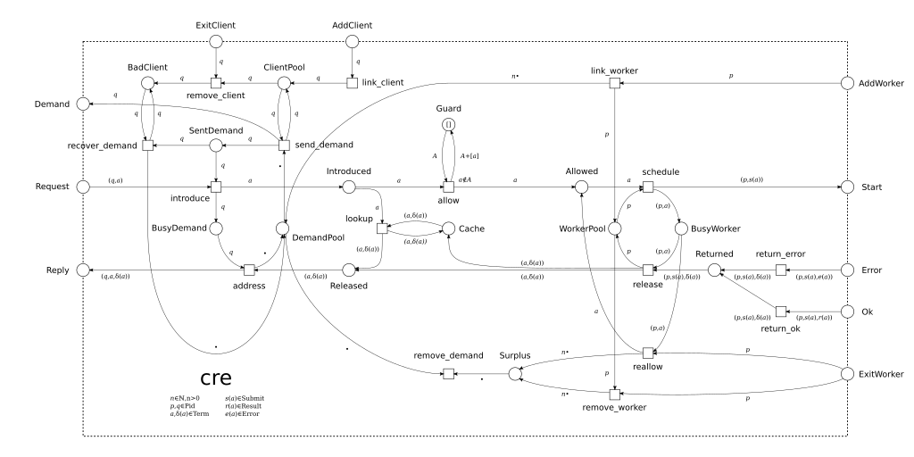

# cre
###### A common runtime environment (CRE) for distributed workflow languages.

 

The common runtime environment (CRE) is a data analysis runtime environment running on top of [distributed Erlang](https://www.erlang.org). The CRE is responsible for managing communication with a CRE client, e.g., a language interpreter, and a number of application-specific worker processes. Herein, the CRE performs scheduling, client and worker failure recovery, client back-pressure, and caching. The CRE itself is application-independent. To specialize the CRE towards a particular application, e.g., a workflow language, the [cre_client](https://github.com/joergen7/cre_client) and [cre_worker](https://github.com/joergen7/cre_worker) behaviors must be implemented. The CRE is based on the [gen_pnet](https://github.com/joergen7/gen_pnet) OTP behavior for modeling concurrent systems and is the featured execution environment for the [Cuneiform](https://cuneiform-lang.org).

*Figure 1: Petri net model of the common runtime environment.*

## Related Projects

- [Hadoop YARN](https://hadoop.apache.org/docs/current/hadoop-yarn/hadoop-yarn-site/YARN.html) is a large-scale data analysis platform that performs resource- and application management. YARN's resource manager is somewhat comparable with the CRE since it performs scheduling and failure recovery. YARN's application master is comparable with a [CRE client](https://github.com/joergen7/cre_client) implementation. It is used with [Hi-WAY](https://github.com/marcbux/Hi-WAY) which can run workflows specified in [Cuneiform](https://cuneiform-lang.org), [Galaxy](https://galaxyproject.org), and [Pegasus DAX](https://pegasus.isi.edu).
- [HTCondor](https://research.cs.wisc.edu/htcondor/) is a high-throughput data analysis platform. It is the underlying execution environment for [Pegasus](https://pegasus.isi.edu) whose workflow specification language is Pegasus DAX.
- [Toil](https://github.com/BD2KGenomics/toil) is a scalable pipeline management system. It is an execution environment running workflows specified in [Common Workflow Language (CWL)](https://github.com/common-workflow-language/common-workflow-language).

## System Requirements

- [Erlang](https://www.erlang.org) OTP 18.0 or higher
- [Rebar3](https://www.rebar3.org) 3.0.0 or higher

## Resources

- [joergen7/cre_client](https://github.com/joergen7/cre_client). A client behavior for the common runtime environment (cre).
- [joergen7/cre_worker](https://github.com/joergen7/cre_worker). The common runtime environment (cre).
- [joergen7/gen_pnet](https://github.com/joergen7/gen_pnet). A generic Petri net OTP behavior, the CRE is based on.
- [joergen7/cuneiform](https://github.com/joergen7/cuneiform). A functional workflow language which can be executed with a Cuneiform-specific CRE.

## Authors

- Jörgen Brandt ([@joergen7](https://github.com/joergen7/)) [joergen.brandt@onlinehome.de](mailto:joergen.brandt@onlinehome.de)

## License

[Apache 2.0](https://www.apache.org/licenses/LICENSE-2.0.html)