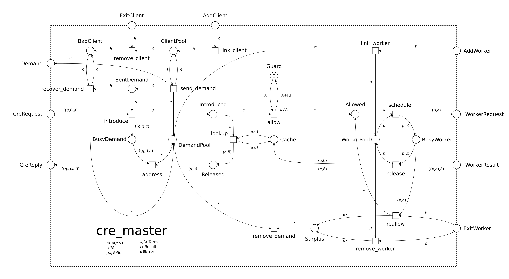
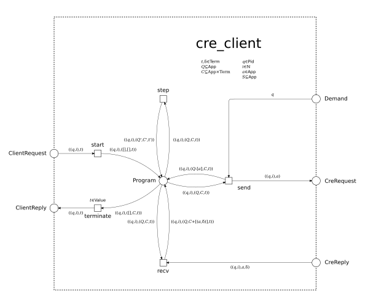
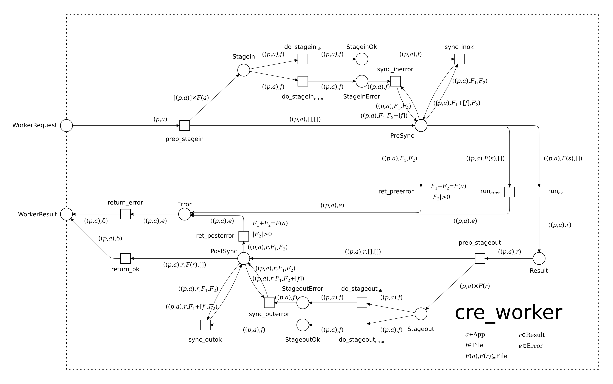

# cre
###### A common runtime environment (CRE) for distributed workflow languages.

[](https://hex.pm/packages/cre) [](https://travis-ci.org/joergen7/cre)

The common runtime environment (CRE) is a scalable execution environment for data analysis workloads running on top of [distributed Erlang](https://www.erlang.org). It is responsible for managing communication with a client, e.g., a language interpreter, and a number of application-specific worker processes. Herein, the common runtime environment performs scheduling, client and worker failure recovery, client back-pressure, and caching. The common runtime environment itself is application-independent. To specialize it towards a particular application, e.g., a workflow language, the `cre_client` and `cre_worker` behaviors must be implemented. The common runtime environment is based on the [gen_pnet](https://github.com/joergen7/gen_pnet) OTP behavior for modeling concurrent systems as Petri nets and is the featured execution environment for the [Cuneiform](https://cuneiform-lang.org) workflow language.




*Figure 1: Petri net model of the common runtime environment's master application. It provides interfaces to client applications (top and left) and worker processes (right).*

## Features

TODO

### Scheduling

TODO

### Fault Tolerance

TODO

### Back-Pressure

TODO

### Caching

TODO

## Usage

### Adding the CRE to a Project

#### rebar3

To integrate the CRE into a rebar3 managed project change the `deps` entry in your application's `rebar.config` file to include the tuple `{cre, "0.1.0"}`.

```erlang
{deps, [{cre, "0.1.0"}]}.
```

#### mix

```elixir
{:cre, "~> 0.1.0"}
```

### Creating a CRE Client Application

TODO



*Figure 2: Petri net model of the common runtime environment's client application. It provides a user interface (top and bottom) and an interface to the master application.*

#### Callback Functions

TODO

#### User Interface

TODO

### Creating a CRE Worker Application

TODO



*Figure 3: Petri net model of the common runtime environment's worker application. It interfaces only to the master application.*

#### Callback Functions

## Example: A Distributed Zero-Order Logic

## Related Projects

- [Hadoop YARN](https://hadoop.apache.org/docs/current/hadoop-yarn/hadoop-yarn-site/YARN.html) is a large-scale data analysis platform that performs resource- and application management. YARN's resource manager is comparable with the CRE since it manages data analysis workloads by performing scheduling and failure recovery for a number of containers.
- [HTCondor](https://research.cs.wisc.edu/htcondor/) is a high-throughput data analysis platform. It is the underlying execution environment for [Pegasus](https://pegasus.isi.edu) whose workflow specification language is Pegasus DAX.
- [Toil](https://github.com/BD2KGenomics/toil) is a scalable pipeline management system. It is an execution environment running workflows specified in [Common Workflow Language (CWL)](https://github.com/common-workflow-language/common-workflow-language).
- [GenStage](https://github.com/elixir-lang/gen_stage) manages communication in producer-consumer networks. Thus, similar to the CRE, it is an application-independent scaffold which can be specialized to data analysis workloads.

## System Requirements

- [Erlang](https://www.erlang.org) OTP 18.0 or higher
- [Rebar3](https://www.rebar3.org) 3.0.0 or higher

## Resources

- [joergen7/gen_pnet](https://github.com/joergen7/gen_pnet). A generic Petri net OTP behavior, the CRE is based on.
- [joergen7/cuneiform](https://github.com/joergen7/cuneiform). A functional workflow language which can be executed with a Cuneiform-specific CRE.

## Authors

- Jörgen Brandt ([@joergen7](https://github.com/joergen7/)) [joergen.brandt@onlinehome.de](mailto:joergen.brandt@onlinehome.de)

## License

[Apache 2.0](https://www.apache.org/licenses/LICENSE-2.0.html)