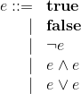
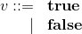
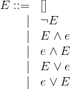
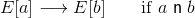
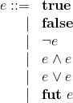
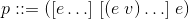
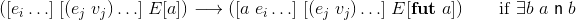
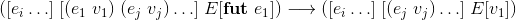

# cre
###### A common runtime environment (CRE) for distributed workflow languages.

[](https://hex.pm/packages/cre) [](https://travis-ci.org/joergen7/cre)

The common runtime environment (CRE) is a scalable execution environment for data analysis workloads running on top of [distributed Erlang](https://www.erlang.org). It is responsible for managing communication with a client, e.g., a language interpreter, and a number of application-specific worker processes. Herein, the common runtime environment performs scheduling, client and worker failure recovery, client back-pressure, and caching. The common runtime environment itself is application-independent. To specialize it towards a particular application, e.g., a workflow language, the `cre_client` and `cre_worker` behaviors must be implemented. The common runtime environment is based on the [gen_pnet](https://github.com/joergen7/gen_pnet) OTP behavior for modeling concurrent systems as Petri nets and is the featured execution environment for the [Cuneiform](https://cuneiform-lang.org) workflow language.


*Figure 1: Petri net model of the common runtime environment's master application. It provides interfaces to client applications (top and left) and worker processes (right).*

## Features

Here, we give an overview of the features, the CRE covers. The primary features of the CRE are scheduling, client back-pressure, fault tolerance, and caching.

### Scheduling

Scheduling is performed by associating a task with a given worker. Once the match has been made, the task is sent to the associated worker and the task-worker pair is ear-marked as busy. Since any task is allowed to be matched with any worker, the net structure effectively implements a random scheduler.

### Client Back-Pressure

Large workloads consisting of 1M tasks or more as well as a large number of clients can spam the master process to a degree where it stops working. The CRE protects itself from being overwhelmed by its clients by applying back-pressure to eager clients.

### Fault Tolerance

The CRE can serve an arbitrary number of clients and can feed an arbitrary number of workers. In large compute clusters this means that there is a realistic chance for one or more connected processes to fail. The CRE creates a link to each client and each worker and appropriately reacts to exit messages which are generated whenever a process stops running. I.e., demand sent to non-existing clients is recollected and tasks sent to non-existing workers are rescheduled. Also, the total amount of demand tokens in the net is kept proportional to the number of live workers.

### Caching

Often in large-scale data analysis applications, the storage needed to keep intermediate results is much cheaper than the compute resources needed to derive these intermediate results. Accordingly, the CRE memoizes all task-result combinations over the duration of the CRE master's run.

## Usage

### Adding the CRE to a Project

#### rebar3

To integrate the CRE into a rebar3 managed project change the `deps` entry in your application's `rebar.config` file to include the tuple `{cre, "0.1.0"}`.

```erlang
{deps, [{cre, "0.1.0"}]}.
```

#### mix

```elixir
{:cre, "~> 0.1.0"}
```

### Creating a CRE Client Application

TODO


*Figure 2: Petri net model of the common runtime environment's client application. It provides a user interface (top and bottom) and an interface to the master application.*

#### Callback Functions

TODO

#### User Interface

TODO

### Creating a CRE Worker Application

TODO


*Figure 3: Petri net model of the common runtime environment's worker application. It interfaces only to the master application.*

#### Callback Functions

## Example: A Distributed Zero-Order Logic

There are several reasons why distributing a zero-order logic this way is utter waste. However, the example is instructive because there is a habitual familiarity of programmers with logic and also because it is a healthy exercise to reflect on when *not* to distribute. Finding out how many yaks were shaved and the curliness of their hides is left to the reader.


### Reduction Semantics

#### Syntax

Here, we show how a simple zero-order logic can be distributed using the CRE. We describe the semantics of this logic as a reduction semantics. Thus, first we introduce its static syntax. It consists of truth values, negation, conjunction, and disjunction. The resulting syntax for expressions *e* looks as follows:



#### Notion of Reduction

Before we introduce the notion of reduction for the above logic, we need to extend the syntax by defining the concept of a value *v*, i.e., an expression that can be the result of an evaluation and that can play the role of an operand in a redex:



Now we are ready to define the notion of reduction in form of the binary relation n. There should be no surprises here.


#### Evaluation Context

Before we introduce the reduction relation for the distributed zero-order logic we need to define the syntax of evaluation contexts:



Note that defining the evaluation context this way does not result in a deterministic reduction relation as would be the desirable when defining a standard reduction relation. This non-determinism allows us to find redexes in many places in the control string. This is important when we define the reduction relation for the CRE, since we want to send as many redexes as possible to the distributed execution environment regardless of how fast the CRE can generate replies.

#### Reduction Relation: A First Try

To get a reduction relation from the previously defined notion of reduction n, we create the compatible closure of n by applying it in the evaluation context *E*:



`[E-red]`

#### Reduction Relation: The CRE Way

The reduction relation defined in `[E-red]` sufficiently describes how evaluation in our zero-order logic is accomplished. However, it applies the notion of reduction in-place, thereby reducing one redex at a time in a sequential manner. Now the sport is to send the redex to a remote service instead of just reducing it, and to do so with as many redexes as we can find in an expression.

Accordingly, the first thing to do is to extend the syntax of expressions *e* with the concept of a future. Futures provide a way to mark redexes that have already been sent away to be computed.



Next, it is not enough to housekeep bare expressions. We need a way to represent redexes awaiting reduction and also redex-value pairs that we get back in return from the remote reduction service.

Accordingly, CRE programs are triples consisting of a queue, a cache, and a control string. This convention is reflected in the way we construct the syntax for programs *p*. In this example, the queue is a list of redexes awaiting reduction, the cache is a list of redex-value pairs holding the redex and the value associated with it according to the notion of reduction, and the control string is an expression under evaluation.



Now that we have defined the evaluation context, we can express what the notion of reduction n means in the context of a program *p*. The updated reduction relation consists of two rules. The first rule defines how redexes are sent to the execution environment. This is achieved by enclosing a redex in a future and by enqueueing the redex.



`[E-send]`

Next we need to define how results which have been received via the cache are substituted into the control string:



`[E-recv]`

The notion of reduction n does not appear directly in the reduction relation anymore (we use it only in a side condition to identify redexes in `E-send`). This reflects the fact that the notion of reduction is applied by the worker and, thus, never explicitly appears in the way reduction is performed in the client.

In real applications, we let the client perform some reductions and defer only the "number crunching" to the CRE. In this example, however, we have the CRE do *all* reductions.

### A CRE Application from the Reduction Semantics

#### Syntax

```erlang
-type e() :: boolean()
           | {'not', e()}
           | {'and', e(), e()}
           | {'or', e(), e()}
           | {fut, e()}.
```

#### Notion of Reduction

```erlang
is_value( T, _UsrInfo ) -> is_boolean( T ).
```


```erlang
run( {'not', X}, _UsrInfo )      -> {ok, not X};
run( {'and', X1, X2}, _UsrInfo ) -> {ok, X1 andalso X2};
run( {'or', X1, X2}, _UsrInfo )  -> {ok, X1 orelse X2}.
```

#### Evaluation Context

```erlang
-type ctx() :: hole
             | {'not', ctx()}
             | {'and', ctx(), e()}
             | {'and', e(), ctx()}
             | {'or', ctx(), e()}
             | {'or', e(), ctx()}.
```

#### Reduction Relation

```erlang
step( {Q, [], T}, _UsrInfo ) ->
  case find_context( T ) of
    {ok, {E, Redex}}   -> {ok, {[Redex|Q], [], in_hole( E, {fut, Redex} )}};
    {error, nocontext} -> norule
  end;
```

```erlang
step( {Q, [{Redex, Value}|C1], T}, _UsrInfo ) ->
  {ok, {Q, C1, subst_fut( T, Redex, Value )}}.
```

## Related Projects

- [Hadoop YARN](https://hadoop.apache.org/docs/current/hadoop-yarn/hadoop-yarn-site/YARN.html) is a large-scale data analysis platform that performs resource- and application management. YARN's resource manager is comparable with the CRE since it manages data analysis workloads by performing scheduling and failure recovery for a number of containers.
- [HTCondor](https://research.cs.wisc.edu/htcondor/) is a high-throughput data analysis platform. It is the underlying execution environment for [Pegasus](https://pegasus.isi.edu) whose workflow specification language is Pegasus DAX.
- [Toil](https://github.com/BD2KGenomics/toil) is a scalable pipeline management system. It is an execution environment running workflows specified in [Common Workflow Language (CWL)](https://github.com/common-workflow-language/common-workflow-language).
- [GenStage](https://github.com/elixir-lang/gen_stage) manages communication in producer-consumer networks. Thus, similar to the CRE, it is an application-independent scaffold which can be specialized to data analysis workloads.

## System Requirements

- [Erlang](https://www.erlang.org) OTP 18.0 or higher
- [Rebar3](https://www.rebar3.org) 3.0.0 or higher

## Resources

- [joergen7/gen_pnet](https://github.com/joergen7/gen_pnet). A generic Petri net OTP behavior, the CRE is based on.
- [joergen7/cuneiform](https://github.com/joergen7/cuneiform). A functional workflow language which can be executed with a Cuneiform-specific CRE.

## Authors

- Jörgen Brandt ([@joergen7](https://github.com/joergen7/)) [joergen.brandt@onlinehome.de](mailto:joergen.brandt@onlinehome.de)

## License

[Apache 2.0](https://www.apache.org/licenses/LICENSE-2.0.html)